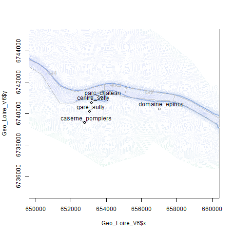

# data_LoireSully-TelemacV8

This repository holds parametric experiments of the Loire-Sully flooding model generated by the Telemac (V8p3r0) system:

* "data/" subdir holds results: 1000 CSV and PNG files
* "src/" subdir holds Telemac parametric model and R launch script

Each CSV file is a matrix of 64x64 cells/pixels which gives its maximum water height (in meters) alongside its flood progression (flood characteristics are given in the name of the CSV file).

The flood is characterized by the following parameters:

* "er": breach erosion, ratio of eroded dike when breach occurs
* "ks2": Strickler coefficient in area 2, roughness of the river bed
* "ks3": Strickler coefficient in area 3, roughness of the river bed
* "ks4": Strickler coefficient in area 4, roughness of the river bed
* "ks_fp": Strickler coefficient in floodplain
* "of": maximum overflooding that generates the breach
* "qmax": maximum flow of flooding
* "tm": time to maximum flooding

Each flood was simulated with Telemac (V8) using Funz-Telemac (https://funz.github.io) parametric launcher, with the Loire-Sully model given in "src/" subdirectory (incl. R launch script).
